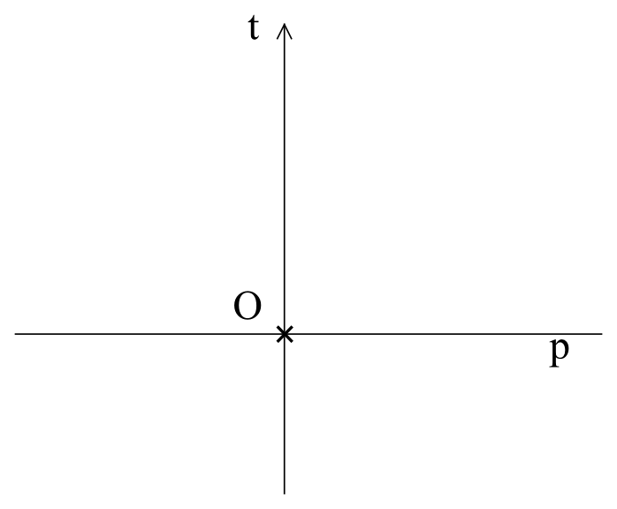

## X. Princip relativity v prostoročasu

Vždy stojí za to pro analýzu vybrat co nejjednodušší model.
Proto naše úvahy začneme od jednorozměrného prostoru, který si můžeme představit ve formě přímky **p**, ve kterém máme nehybného pozorovatele **O**. Jestliže přidáme čas jako přímku **t** kolmou k prostoru **p**, dostaneme dvourozměrný prostoročas (obr. 8).

Obrázek 8

Předpokládáme, že náš pozorovatel se nepohybuje v prostoru (nebo přesněji:
nepohybuje se vzhledem k systému souřadnic, který je s ním spojen), to znamená že v prostoročasu
se bude pohybovat pouze ve směru osy **t** 
a v následujících okamžicích **t1**, **t2**, **t3** se bude nacházet
v bodech **t1**, **t2**, **t3** na ose **t** (obr. 9).

Obrázek 9

Přidejme do našeho modelu ještě jednoho pozorovatele P, který se bude od pozorovatele O
vzdalovat rovnoměrným přímočarým pohybem. Jeho dráha v prostoročasu bude mít tvar přímky
nakloněné vzhledem časové ose pozorovatele O pod jistým úhlem,
jehož velikost bude závislá na rychlosti, jakou se pozorovatel P vzdaluje od pozorovatele O (obr. 10).

Obrázek 10

Princip relativity nám říká, že pohyb je relativní. Jestliže máme dva pozorovatele,
kteří se od sebe vzdalují, není možné určit, kdo je v klidu a kdo se pohybuje.
To znamená, že pozorovatel P může tvrdit, že to on je v klidu a nepohybuje se v prostoru
a že pozorovatel O se od něj vzdaluje. Pro něj čas plyne ve směru jeho pohybu v prostoročasu,
to znamená podél přímky **u** a prostor pro něj probíhá ve směru přímky **r** (obrázek 11).

Obrázek 11

Pokud se budeme držet principu relativity, pak situace pozorovatele O i pozorovatele P
musí být analogická.

Vzhledem k tomu, že celou operaci můžeme opakovat počínaje pozorovatelem P
a rychlost vzdalování se náledujícího pozorovatele můžeme měnit, zdá se,
že v našem prostoročase může prostor i čas probíhat libovolným směrem.
Protože světlo se musí pohybovat stejně pro každého pozorovatele, znamená to,
že se šíří stejnou rychlostí všemi směry prostoročasu a že pro světlo neexistuje čas.

Hned je ale vidět několik problémů. Například co to vlastně je rychlost světla,
jestliže pro světlo  neplyne čas a celý prostoročas pro něj znamená jenom prostor.
Anebo ješte závažnější problém týkající se příčinnosti.
Jestliže směr času v prostoročasu může být libovolný, pak se může stát,
že pro dva různé pozorovatele  může plynout v opačném směru. To by ovšem porušovalo kauzalitu.
Tady se musíme v našich úvahách  zastavit a promyslet, kde může být chyba
a které naše předpoklady musíme změnit.

Často je těžké najít řešení z toho důvodu, že některé předpoklady přijímáme nevědomky.
Jsme naučeni a přivyklí na určité názory a vůbec o nich neuvažujeme jako o předpokladech.
Takže není snadné přijít s nápadem, že problém s kauzalitou může být způsoben tím,
že píšeme a kreslíme na plochém listu papíru a v důsledku toho je náš model plochý.
Jenomže jestli není plochý, tak jaký? První nápad je, že rovinu začneme ohýbat a uděláme z ní povrch koule.
Jenomže koule nejenže problém neřeší, ale ještě vytvoří další: co se stane,
jestliže pozorovatel oběhne celou kouli v čase a vrátí se do místa, ze kterého vyšel?
Všechny tyto problémy zmizí, jestliže se koule začne rozpínat.
Získáme úplně jinou představu o čase. Čas tu má dva rozměry. Lokální čas,
který je pro každého pozorovatele jiný a jeho směr v prostoročasu závisí na rychlosti
a čas kosmický ve směru rozšiřování se vesmíru, který je v daném místě stejný pro všechny pozorovatele
a týká se i světla. V takovém modelu není narušena zásada kauzality, protože i v případě,
že lokální čas dvou pozorovatelů běží v opačném směru, čas kosmický zajistí, že sled událostí je zachován.

## [XI. Komplexní čas a prostoročasový interval ](rozdzial11) 
