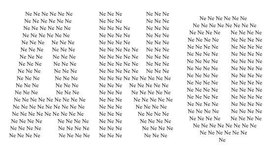

## XIII. Zakończenie

Skutečnost je vždy bohatší než jakýkoliv model. Abychom se co nejvíce přiblížili skutečnosti,
modely se stávají čím dál komplikovanější a používaný matematický aparát je tak složitý,
že mu kromě specialistů v daném oboru nikdo nerozumí. Jenomže rozumět nějakému modelu,
to ještě neznamená rozumět realitě. Rovnice nic neříkají o tom, jak máme interpretovat výsledky výpočtů.

Příklad pro nás netypické interpretace výsledku výpočtů uvádí Marcel Granet ve své knize
"La pensée chinoise". Popisuje legendu, ve které se generálové před bitvou rozhodovali,
zda zaútočit nebo ustoupit. Protože se nemohli dohodnout, rozhodli se hlasovat.
Ukázalo se, že tři jsou pro útok a osm je proti. Zdálo by se, že výsledek hlasování
je nutné interpretovat tak, že je třeba ustoupit. A přesto v důsledku toho hlasování generálové
se rozhodli zaútočit, protože číslo "tři" pro ně bylo číslem vyjadřujícím jednomyslnost.
Zaútočili a zvítězili.

To, že něco vypočteme, ještě neznamená, že víme jak to interpretovat. Realita není černobílá a jenoznačná. Při jakémkoliv rozhodování postupujeme podle  nějakého zjednodušeného schématu a záleží na tom jaké detaily jsou pro nás v dané chvíli důležité. Na základě toho, co je napsáno níže, rozhodneme se pro **ANO** nebo **NE**?

Kromě jiného záleží na tom, z jaké vzdálenosti se díváme.

Při malých vzdálenostech si můžeme myslet, že se světlo pohybuje nekonečnou rychlostí
a že všechno je takové, jaké to vidíme. Za těchto podmínek si můžeme myslet,
že okolo sebe vidíme trojrozměrný prostor.

Jestliže pozorujeme oblasti tak vzdálené, že světlo od nich k nám přichází s výrazným zpožděním,
potom nesledujeme prostor, ale různé části prostoročasu. Interpretace toho, co vidíme,
není výsledkem výpočtů, ale našeho myšlení...

## [Literatura](literatura) 
