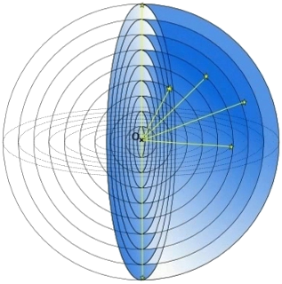
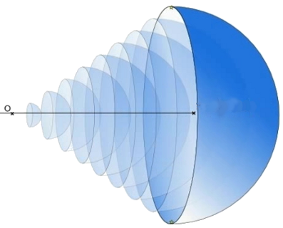
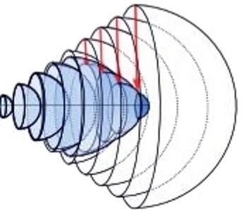
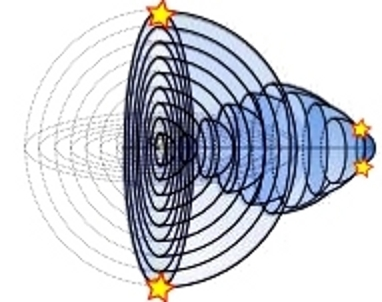

## II. Viditelná část vesmíru

*Za to, že vůbec máme jakékoliv informace o vesmíru, vděčíme  tomu, že vesmír je vyplněn nejrůznějším vlněním.
Obraz vesmíru tvoříme pouze na základě vln, které k nám dorazí a které umíme zaregistrovat.
Na základě našich zkušeností z malých vzdáleností se domníváme, že viděné objekty se nacházejí ve směru,
z kterého k nám přichází od nich světlo a ve vzdálenosti rovné dráze světla od objektu k nám.
Obecně to nemusí být pravda ...*

<!--Moje první úvahy o geometrii vesmíru probíhaly zhruba následujícím způsobem:

Vzhledem na konečnou rychlost světla nevidíme objekty na nebi tak, jak vypadají v tuto chvíli,
ale tak, jak vypadaly před nějakým časem. Slunce vidíme tak, jak vypadalo před okolo 8 minutami,
nejbližší hvězdy před několika lety a vzdálené galaxie před miliardami let.
Nejvzdálenější objekty jsou nejstarší. Můžeme si představit, že se nacházejí  na ohromné sféře
o průměru mnoha miliard světelných let.

Jenomže jestliže budeme předpokládat, že vesmír byl zpočátku malý, pak ta nejstarší sféra nemůže být velká.
Není důležité, zda na té pomyslné ohromné sféře vidíme nějaké konkrétní objekty nebo ne.
Není pro nás v tuto chvíli ani důležité, zda již tehdy bylo světlo.
Jestliže se vesmír zpočátku nacházel v jednom bodě, potom pro nás ten bod leží nejdále ze všeho.
A to, co je nejdále od nás se nám jeví jako ohromná sféra ...

Jak vysvětlit, že něco malého se nám zdá tak velké? V první chvíli se to zdá absurdní.
Jak se celý vesmír může nacházet uvnitř malé sféry nebo dokonce uvnitř jednoho bodu?  

*Než budeme pokračovat, zkusme  provést následující myšlenkový experiment.
Představme si, že na povrchu zeměkoule jsou rozmístěna světélka a do každého podél poledníku vede světlovod.
My sedíme v kruhové místnosti na severním pólu a dokola máme obrazovky, na kterých můžeme sledovat všechna světélka.
Přes okno vidíme do všech stran natažené světlovody i představujeme si, že každé světélko se nachází v přímé linii
ve směru, v kterém vychází z místnosti světlovod. Můžeme též určit délku každého světlovodu
(například vysláním světlovodem světelného signálu a  počkáním na jeho návrat),
kterou chápeme jako vzdálenost světélka od nás. Body od nás stejně vzdálené budou ležet na rovnoběžkách.*

*Jestliže budeme přesvědčeni, že všechna světélka se nacházejí v jedné rovině,
pak můžeme na listu papíru narýsovat příslušnou mapu.
Jednotlivým rovnoběžkám čím dál od nás vzdálenějších budou odpovídat kružnice o čím dál větlším poloměru.
Ve chvíli, kdy překročíme rovník, délky rovnoběžek se budou zmenšovat,
ale poloměry kružnic na naší mapě se budou dále zvětšovat. Nejvzdálenějšim bodem, který můžeme pozorovat
je jižní pól. Budeme ho vidět v každém směru, kdekoliv se podíváme a bude se nám jevit jako ohromné kolo, ve kterém jsou všechny ostatní body...*

Vraťme se k problému, jak si představit rozmístění objektů v prostoročasu a určit dráhu světla v rozpínajícím se vesmíru.
Můj způsob myšlení byl následující:

Celý viditelný vesmír si můžeme představit jakoby poskládaný ze sfér o čím dál větším poloměru.
Přitom čím větší poloměr, tím starší sféra (obr.1).

Obrázek 1.

Jestliže dodáme čas jako další rozměr a každou sféru umístíme v odpovídajícím čase,
pak sféry vytvoří čtyřrozměrný kužel (obr.2).

Obrázek 2.

*Jestliže má někdo problémy s představením si čtyřrozměrného kužele, může ubrat jednu dimenzi
a omezit se pouze na řez viditelným vesmírem. Místo sfér (které  v mysli protneme rovinou),
dostaneme systém soustředných kružnic v rovině,
které po přidání času jako dalšího rozměru utvoří povrch obyčejného kužele.*

Jestliže se vesmír rozpíná, pak při couvání v čase se musí zmenšovat.
Nejstarší sféry musí být malé (obr.3).  

                       

Obrázek 3.

Objekty, o kterých si myslíme, že jsou od sebe velmi vzdálené, mohou být v prostoročasu blízko sebe (obr.4).

Obrázek 4.

Jestliže si představíme viditelnou část vesmíru jako systém různě starých sfér,
které jsou odpovídajícím způsobem zmenšené a rozmístěné v prostoročasu,
vyřešíme několik kosmologických problémů najednou. Přestane být problémem homogenita reliktního záření,
jestliže si uvědomíme, že i když se nám zdá, že záření přichází ze všech stran z velkých vzdáleností,
přichází vlastně z malé oblasti prostoročasu (obr.5).

Obrázek 5.

Je vidět, že v pozorovatelném vesmíru nejsou oblasti kauzálně disjunktivní, neboť čím jsou objekty dále od nás,
tím jsou si blíž. Není potřebná kosmická inflace, čili ohromné  zvětšení vesmíru ve zlomku vteřiny,
protože k ohromnému zvětšení rozměrů nejstarších sfér dochází pouze v naší představě.
Pochopíme, že jestliže si někdo představuje jistou oblast zakřiveného prostoročasu jako nezakřivený trojrozměrný prostor,
pak v takovém prostoru vzdálené oblasti musí být roztažené podobně, jak jsou roztažené oblasti na ploché mapě glóbu.
V takovém prostoru se nám též musí zdát, že chybí ohromné množství hmoty i energie ...

Vyplývá z toho, co jsme dosud řekli, něco o geometrii prostoru?

Pouze to, že na základě přímého pozorování se nedá určit, zda je prostor zakřivený nebo nezakřivený.
To co si představujeme jako nezakřivený trojrozměrný prostor se skládá z různě starých sfér
rozmístěných nějak v prostoročasu, které navíc vidíme různě roztažené.

(Předpoklad, že čas je lineární a prostoročas si můžeme představovat jako jednotlivé okamžité prostory
poskládané jeden vedle druhého podél linie času, nemusí být pravdivý.
Nezávisle na tom si ale můžeme viditelnou část vesmíru představovat jako systém různě starých sfér.)

Bez ohledu na to, jestli je prostor zakřivený nebo plochý, z každého okamžitého prostoru vidíme jen a pouze sféru.
To nám neumožňuje určit zakřivení prostoru.

Současně je vidět, že jestliže chceme získat správý obraz vesmíru, musíme určit rozmístění objektů v prostoročasu.
A tu se objevuje další problém. Jak určit vzdálenosti v prostoročasu?
V matematických modelech se k tomu účelu používá prostoročasový interval
(více o prostoročasovém intervalu bude ještě v kapitole o prostoročasu). Jestliže ho zkusíme použít v praxi,
dosaneme hodnotu nula pro všechny objekty, které v danou chvíli vidíme.
Ukazuje se, že prostoročasový interval v pozorovaném vesmíru není vzdálenost dvou událostí v prostoročasu,
ale vzdálenost mezi světelným signálem o jedné události a druhou událostí.

Jestliže chceme určit správné rozmístění objektů ve vesmíru, musíme nalézt vhodnější definici vzdálenosti v prostoročasu.
Úkol není snadný. Abychom dobře pochopili problém, musíme přeanalyzovat celou cestu od vzniku pojmu prostoročasu
až po určování vzdáleností v něm. Potom musíme  určit, při jakých předpokladech byl utvořen prostoročasový interval
a které z těch předpokladů mohou být změněné. Nakonec musíme najít nějaké nové možnosti.
Tu se neobejdeme bez trošky matematiky, pokusím se to udělat co nejpřístupnější formou.

## [III. Matematika a mozek](rozdzial3) -->
