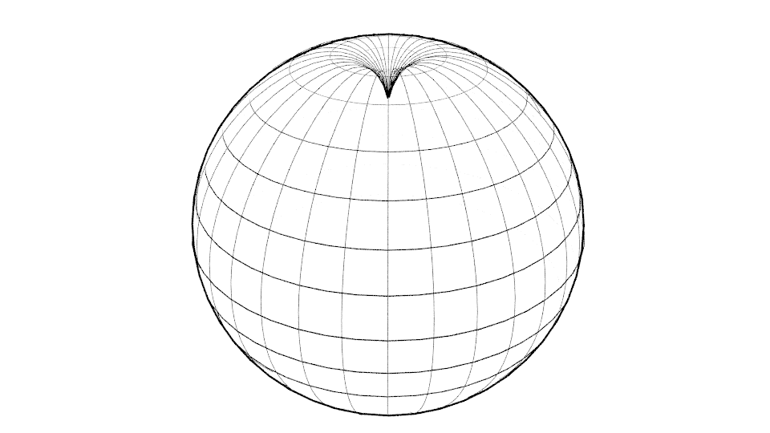

## III. Matematika a mozek

Tentýž problém můžeme často řešit buď pomocí matematických rovnic anebo geometricky.
Například gravitaci můžeme považovat za sílu a  popsat ji rovnicí anebo ji vysvětlit geometricky zakřivením prostoročasu.

*Pravděpodobně nejde jen o použítí jiného nástroje, ale i jiné mozkové hemisféry.
Rovnicemi se zabývá levá hemisféra a geometrickou představivostí pravá.
Proto pro plné porozumění stojí za to nejen umět něco vypočítat, ale též si to umět představit.*
...
<!--Čísla můžeme chápat jako abstraktní symboly nebo si je můžeme představovat jako body na přímce, nazývané číselnou osou.
Bod odpovídající číslu x se nachází ve vzdálenosti x od bodu označeného jako nula
(na jednu stranu kladné a na druhou záporné). Jestliže každému bodu na přímce přiřadíme právě jedno číslo,
dostaneme tak zvaná reálná čísla.

Rovinu můžeme spojit s čísly například tím způsobem, že každý bod roviny ztotožníme s dvojicí reálných čísel.
Dostaneme tímto způsobem souřadnice každého bodu roviny.

(Tím způsobem můžeme snadno rozšířit geometrii na libovolný počet rozměrů n,
jenom každý bod místo dvojice čísel bude definovaný posloupností n reálných čísel x=(x1,x2,...,xn).
Jestliže pro kažkou dvojci bodů x a y zavedeme pojem jejich vzájemné vzdálenost vzorcem

$$ d = \sqrt {(y_1-x_1)^2+ ... +(y_n-x_n)^2}  $$,

získáme euklidovský prostor)

Různé geometrické útvary, například přímka nebo kružnice, jsou v tomto smyslu množinou bodů
splňujících příslušnou rovnici. Geometrické problémy pak můžeme vyřešit pomocí rovnic,
což z praktického hlediska bývá výhodnější.

Zdánlivě je to jedno, jestli problém řešíme geometricky nebo algebraicky, protože výsledek musí být stejný.
Nejde ale pouze o výsledek, jde rovniež o pochopení celého problému. Jestliže pouze řešíme rovnice
a  nebereme po celou dobu na vědomí, co vlastně řešíme,  mohou později vzniknout problémy při interpretaci výsledků
a určení, co vlastně znamenají v reálném světě. Jestliže problém formulujeme geometricky,
můžeme si někdy snáze všimnout různých aspektů, které v rovnicích nevidíme. 

Ukažme si to na příkladu gravitace. Podle Newtonovy gravitační teorie máme rovnici

$$ F = G * \frac{M * m}{r^2}  $$

kde F je přitažlivá síla, G je gravitační konstanta, M je hmotnost jednoho objektu, m hmotnost druhého objektu,
r vzdálenost mezi objekty. Rovnice dobře funguje v každodenní praxi,  ale zdá se, že pro hodně velké vzdálenosti
může být potřebná modifikace. Jenomže nevíme ani jaká, ani proč. Můžeme postupovat podobně jak Kepler
při zkoumání pohybu planet. Sebrat ohromné množství informací na základě pozorování a zkoušet modifikovat rovnice
takovým způsobem, abychom dosáhli shody se získanými údaji. Dokonce i když uspějeme, nebudeme vědět, proč  je to právě tak.

Jestliže se pokusíme podívat se na gravitaci jako na zakřivení prostoročasu,  bude těžší získat přesné výsledky,
ale zato bude mnohem lehčí si všimnout toho, že problém souvisí s nekonečnem.

Není potřebné si představovat nekonečný čtyřrozměrný prostoročas, stačí se omezit do dvou rozměrů.
Takový prostoročas si můžeme představit jako pružnou rovinu, ve které se pod tíhou objektu utvoří důlek (obr. 6).

Obrázek 6

Jestliže máme nekonečnou rovinu, pak deformace může být roztažena do nekonečna shodně s výše uvedenou rovnicí.
Zatímco snadno si můžeme představit prostoročas jako pružnou kouli. V tom případě nemáme žádné nekonečno
a deformace bude omezena pouze na jednu polokouli. (obr. 7).  

Obrázek 7

Nejenomže hned vidíme, že v tom případě je potřeba rovnice zmodifikovat, ale hned máme i náznak, jakým způsobem.
Zaroveň si můžeme uvědomit, že Newtonovy rovnice (a ne jenom Newtony, ale téměř všechny)
obsahují v sobě předpoklad nekonečna. 

Problém nekonečna je v jistém smyslu klíčový. Jestliže je vesmír konečný, nemůže být nezakřivený.

Již dříve jsme ukázali, že pozorováním se nedá zjistit žádné zakřivení prostoru.
Vyplývá to z faktu, že ve skutečnosti vidíme pouze světlo, které má od nás nulovou vzdálenost.
Obraz nezakřiveného trojrozměrného prostoru vzniká jen v naší mysli.
Nemáme možnost přemísťovat se na velké vzdálenosti a provádět nějaká měření vzdáleností nebo úhlů
mezi různými galaxiemi, které jsou navíc stále v pohybu.  Z jednoho místa v prostoru se nedá změřit jeho zakřivení.

Nyní vidíme, že výpočty též  mohou být matoucí. Z rovnic může vycházet nezkřivený prostor pouze proto,
že používáme matematiky ve které je číselná osa nekonečná. Jestliže na začátku předpokládáme,
že prázdný prostor je popsán rovnicí, ve které je nějakým způsobem obsažen předpoklad nekonečna,
pak se nemůžeme divit, že  později obdržíme výsledek, že prostor je nekonečný. 

Existuje však několik logických argumentů pro předpoklad, že je prostor konečný.
Zaprvé žadné nekonečno ve skutečném světě se nedá potvrdit ani pozorováním ani pokusem.
Zadruhé, jestliže předpokládáme, že vesmír má začátek v čase, pak čas musí být konečný.
Z konečného prostoru se nemůže v konečném čase stát nekonečný prostor.
Kdyby prostor měl být nekonečný, pak by musel být nekonečný od počátku. Zdá se ale, že prostor a čas
jsou v prostoročasu spojeny takovým způsobem, že to, co je pro jednoho pozorovatele časem,
může být pro jiného pozorovatele prostorem a naopak. V tom případě se zdá nepravděpodobné,
že čas by mohl být konečný a prostor nekonečný. Konečný vesmír dává také možnost vysvětlit jevy,
které současná kosmologie vysvětlit neumí. Například existenci ohromných černých děr v ranném vesmíru.
Jestliže připustíme, že vesmír má tvar koule, pak vzdálenosti pozorovaných objektů mohou být jiné než si myslíme.
V nezakřiveném prostoru intenzita světla klesá se čtvercem vzdálenosti. Zatímco na povrchu koule světelná vlna nejprve slábne, ale po dosažení druhé polokoule znovu sílí. Může též probíhat po povrchu koule mnohokrát tam i zpět.
Vzdálenosti i stáří pozorovaných objektů mohou být v tom případě  úplně jiné než v případě, kdy předpokládáme,
že prostor je nezakřivený.

V této fázi nemáme žádný důkaz, že prostor je konečný. Máme však dobré důvody pro důkladné prozkoumání
takového předpokladu. Jestliže připustíme možnost, že prostor je konečný, pak z toho plyne, že nemůže být nezakřivený.
V tom případě se musíme podívat na geometrie neeuklidovské. 

## [IV. Neeuklidovské geometrie a určování vzdáleností](rozdzial4) -->
