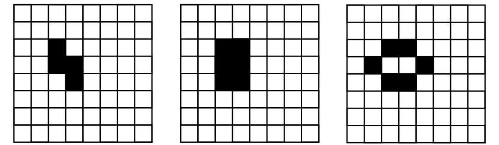
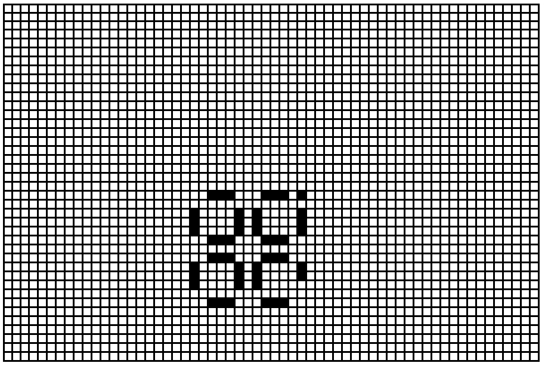
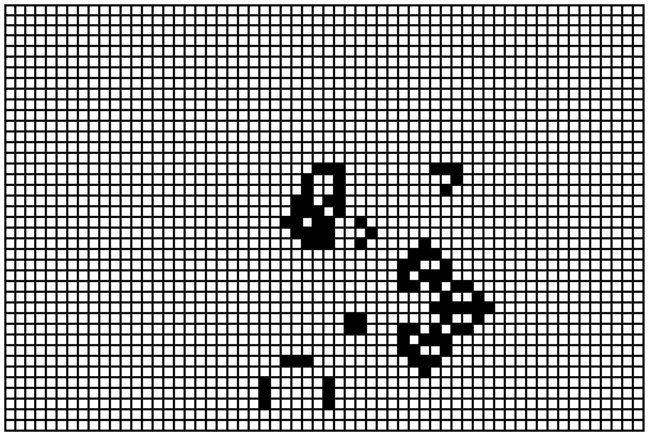

## Buněčné automaty

Buněčné automaty jsou zajímavé kromě jiného tím, že ukazují, jak i jednoduchá pravidla mohou generovat složité chování.
Uvedeme si zde několik příkladů ze „Hry života” (Game of Life). Pravidla jsou taková, že na dvourozměrné mřížce mohou mít buňky dva stavy – být mrtvé nebo živé. Živá buňka zůstane v následujícím kroku živá, pokud má kolem sebe dvě nebo tři živé buňky, jinak umírá, a mrtvá buňka v následujícím kroku ožívá v případě, že má kolem sebe právě tři živé buňky. Na obrázcích je mrtvá buňka bílá a živá buňka černá.

Příklad 1. Jednoduchý případ vývoje, který spěje do fixního stavu, ve kterém se již stav buněk nemění: 

1a) Obrazce se postupně zmenšují, až zůstane prázdné pole:

1b) Postupně se dojde k obrazci, který se již nemění:

Příklad 2. Jednoduché periodické struktury, které se neustále opakují:

2a) Asi nejjednodušší periodicky se opakující obrazec:

2b) A ještě jedna trochu složitější struktura, která se periodicky opakuje:

Pokud máme nějaký program, který nám zobrazí situaci po zadaném počtu kroků, můžeme zkoumat, co se stane, jestliže trochu změníme počáteční konfiguraci.

Například v obrazci z příkladu 2b přesuneme jedno pole o několik míst. Z obrazce, který se periodicky opakoval, odstartuje úplně nepředvídatelný vývoj:

Výchozí stav, kde jsme změnili souřadnice jednoho pole:

Stav po 71 krocích:

Stav po 80 krocích:

Stav po 409 krocích:

Stav po 730 krocích:

Vidíme zde, že změna jednoho pole v původním obrazci může vést ke vzniku mnoha nových struktur,
které mohou být dost složité a výrazně se lišit od původního obrazu.
