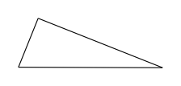
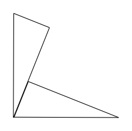
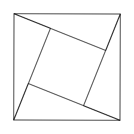
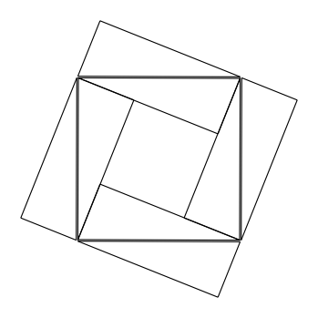
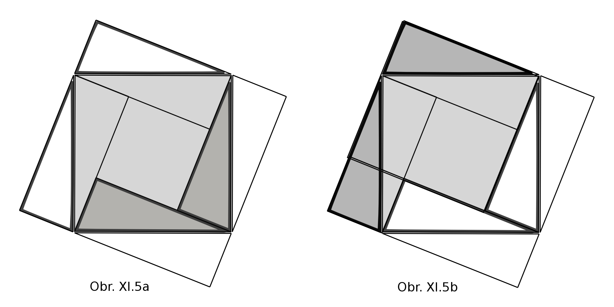
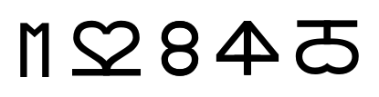
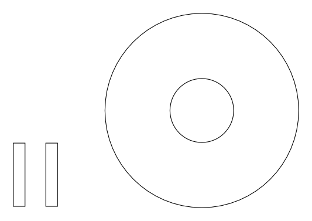

## XI. Odkud se berou nové nápady

Dost rozšířený je názor, že schopnost vymýšlet něco nového mají pouze lidé.
Vymýšlení vyžaduje rozum a inteligenci, které kromě lidí nikdo nemá,
a to činí lidi něčím výjimečným ve vesmíru. Zvířatům se přisuzují pouze instinkty,
někdy hodně komplikované, ale prakticky neměnné, a že by něco nového mohl vymyslet počítač,
to se už úplně vylučuje.
...
<!--Je možné ale naopak tvrdit, že žádné nové nápady nikdy nevznikají, že už existují od počátku světa
buď v mysli Boha nebo v nějaké praformě ve Vesmíru a lidé je pouze odhalují.
Takový obraz mohl vzniknou nejen jako důsledek víry, ale též jako důsledek klasické fyziky.
Pokud by každý stav jednoznačně vyplýval z předchozího stavu, pak by se ani nemohl zrodit žádný nový nápad,
který by automaticky nevyplýval z minulosti. Kromě toho při aplikaci druhé termodynamické věty
na celý vesmír – při použití nejobecnější definice informace jako opaku entropie – bychom dostali,
že informace ve vesmíru neustále ubývá.

Teprve princip neurčitosti v kvantové fyzice dal teoretickou možnost vzniku nových nápadů – nebo obecně - vzniku
čehokoliv nového. Pokud máme k dispozici dostatečné množství částic a dostatečně dlouhou dobu,
mohou vzniknout nejrozmanitější struktury, které nijak nevyplývají z počátečního stavu.
Je zde ale jeden problém. Jak takovou užitečnou strukturu rozpoznat a zadržet.

Představme si, že máme balíček karet, které jsou dobře promíchány. Jaká je šance,
že dáme-li jej do míchacího stroje, který je bude náhodně míchat, budou po nějakém čase
uspořádané podle barev a velikosti? Pokud máme dost času, pak taková situace někdy nastane,
ale stroj bude míchat dál a hned ji zase rozmíchá.

Princip neurčitosti nám dává možnost připouštět, že něco nového může vzniknout náhodou, ale zároveň zpochybňuje,
že by to mohlo existovat delší dobu.

Jedna z možností, jak si s tímto problémem poradit, je použít buněčné automaty.
Viděli jsme, že chování buněčných automatů závisí na počáteční konfiguraci, a může náležet do jedné
ze čtyř skupin: buď se nic neděje (nebo k tomu směřuje), nebo vznikají jednoduché cykly,
nebo je chování naprosto chaotické, nebo konečně vzniká zajímavá struktura,
která se nějakým způsobem rozvíjí.

Pokud si celý vesmír představíme jako ohromný buněčný automat, kde každá částice reaguje s částicemi
ve svém okolí na zásadách daných jednoduchými pravidly, pak i při náhodném počátečním stavu částic
mohou náhodnými změnami vzniknout v některých místech kombinace patřící do čtvrté skupiny,
které povedou ke vzniku složitého chování, množení struktur a tím i zajištění jakési stability.

Máme tedy jakousi teoretickou základnu připouštějící, že díky kvantovým jevům může vznikat
něco úplně nového, co se může díky vlastnostem buněčných automatů dále rozvíjet,
a vraťme se zase k novým nápadům. Nejprve bychom si měli ujasnit, co pod tím pojmem budeme rozumět.
Jednak by mělo vzniknout něco nového, ale to samo o sobě nestačí. Klasický program
pracující na základě daného algoritmu též vytváří něco nového, ale výsledek je jednoznačně určen
počátečními daty a algoritmem. Kvantový počítač naopak může generovat něco úplně nového,
co nijak nevyplývá z jeho počátečního stavu, ale mohou to být nesmysly a ne nový nápad.

Pravděpodobně k tomu, co obvykle označujeme jako nový nápad, kvantové jevy nepotřebujeme.
V novém nápadu nejde o to, aby vzniklo něco úplně nového, co nijak nesouvisí s tím, co už známe,
ale o odhalení nových vztahů nebo kombinací známých částí nebo postupů.
V praxi to může být například idea nějakého vynálezu nebo uměleckého díla nebo způsobu,
jak vyřešit nějaký problém, s jakým jsme se dříve nesetkali.

Abychom si ukázali, jak se rodí nový nápad, pokusme se zrekonstruovat,
jak mohl třeba Pythagoras přijít na svou známou větu o čtvercích nad stranami pravoúhlého trojúhelníka.

Začneme od představy, že mohl někde na pláži otisknout do písku pravoúhlý trojúhelník  (obr. XI.1).

Obr. XI.1  Pravoúhlý trojúhelník.

Pokud druhý trojúhelník vhodně přiložíme k prvnímu, dostaneme znovu pravý úhel (obr. XI.2).

Obr. XI.2  Dva stejné pravoúhlé trojúhelníky vhodně přiléhající k sobě tvoří opět pravý úhel.

Ze čtyř trojúhelníků můžeme vytvořit čtverec,
jehož strana bude rovna nejdelší straně trojúhelníka (obr. XI.3)

Obr. XI.3  Čtyři stejné pravoúhlé trojúhelníky vhodně přiléhající k sobě vytvoří čtverec.

Zde bychom se mohli zamyslet nad tím, odkud se bere u lidí obliba v symetrických obrazcích.
Je možné, že jsou pro náš mozek sympatické z toho prostého důvodu, že se dají snadněji zapamatovat,
než nepravidelné tvary. Celá informace o symetrickém obrazci se dá několikanásobně zkompresovat,
co může vést k preferování takových obrazců i u umělých neuronových sítí.

Pokud budeme pokračovat v tvorbě symetrického obrazce a vhodně umístíme dokola ještě čtyři trojúhelníky,
dostaneme znovu čtverec, tentokrát o délce strany rovné součtu kratších stran trojúhelníka (obr. XI.4).

Obr. XI.4  Čtverec vytvořený z osmi stejných pravoúhlých trojúhelníků vhodně přiléhajících k sobě.

Nyní již stačí pouze analyzovat obrazec, abychom odkryli Pythagorovu větu (obr. XI.5.a , obr. XI.5.b).

Obrázky XI.5.a, XI.5.b

Stačí si uvědomit, že všechny trojúhelníky jsou stejné, a tedy zaznačená plocha na obrázku XI.5.b
je stejná, jako plocha zaznačeného čtverce na obrázku XI.5.a. Nový nápad se objeví ve chvíli,
kdy si uvědomíme, že zaznačená plocha obrázku XI.5.b je tvořena ze dvou čtverců,
jejichž boky se rovnají kratším stranám pravoúhlého trojúhelníka. 

Na tomto příkladu je vidět, že k odhalení něčeho nového někdy stačí skládat nové celky ze známých částí,
různě je znovu rozkládat, porovnávat a hledat nové souvislosti.
Nový nápad se objeví ve chvíli, kdy najdeme novou užitečnou kombinaci nebo nový vztah.

Jak ale vlastně postupuje mozek, aby toto nové řešení nalezl? Nejde nám zde o to,
abychom vytvořili model, který by věrně odpovídal skutečnosti. Chceme pouze nalézt model,
který by nám později umožnil dosáhnout toho, aby i počítač dostával nové nápady a řešil nové úlohy.
Takže následující text není úplně přesný, ale měl by nám stačit k tomu,
abychom si udělali jakousi představu, jak možná mozek pracuje.

Lidé si často myslí, že největší možnosti mozku jsou reprezentované vědomím a logickým myšlením.
Ale to vůbec nemusí být pravda. Naše vědomí postupuje lineárně a většinou můžeme myslet
v jedné chvíli jen na jednu věc. Naproti tomu v podvědomí mohou probíhat miliony operací současně,
mohou se vytvářet pentle a zpětné vazby, řetězce informací se mohou dělit na části a skládat
v nejrůznějších kombinacích, mohou též být modelovány různé buněčné automaty,
které mohou vytvářet nové struktury a dostávat nové nápady.
Kromě toho mozek nepracuje jako číslicový počítač, ale jako hybridní,
informace se přetváří nejen elektrickými signály, ale též chemicky.
Existuje též podstatný rozdíl v práci levé a pravé hemisféry. Zdá se, že logické myšlení
a slovní formulace, které vyžadují číslicové zpracování, jsou umístěné v levé hemisféře,
a v pravé hemisféře, která řídí například prostorové vnímání, umělecké dovednosti a emoce,
probíhá simultánní zpracování, možná i analogové, co umožňuje dosáhnout mnohonásobně větší výkonnosti
a rychlosti. Do hledání nových nápadů a řešení problémů je tedy vhodné zapojit raději pravou hemisféru,
neboť vědomí a logické myšlení v tom mohou někdy dokonce překážet.
Zdají se to potvrzovat případy autistických savantů, kteří dokáží při podprůměrné inteligenci
v některých oblastech dosahovat neuvěřitelných výkonů pomocí pravé hemisféry. Často se též stává,
že problém, se kterým jsme si nevěděli rady, vyřešíme ve snu, kdy vědomí a levá hemisféra
přenechají problém podvědomí.

Ale i když řešíme problém, jenž vyžaduje nějaký nový nápad, při plném vědomí a snažíme se postupovat
logicky, většinou nejsme schopni říct, odkud se náš nový nápad vzal. Zdá se nám,
že se nápad objevil odnikud, pomocí jakési intuice, ale asi nám ho podsunulo podvědomí,
které může pracovat simultánně a nalezlo řešení rychleji, než lineární logické uvažování.

Příkladem úlohy, která to potvrzuje, je nalézt další člen posloupnosti na obrázku XI.6.

Obr. XI.6 Jaký bude následující znak posloupnosti?

V mém případě několik hodin přemýšlení a logické analýzy nic nedalo.
Teprve když jsem začal myslet na něco jiného, řešení se náhle samo vynořilo někde z podvědomí.

Neznamená to, že se nic nedá vymyslet logickým uvažováním. Jenom je třeba vymanit se z ustálených
schémat a z dosavadní struktury uvažování. Rozkládat celky na části a tvořit nové kombinace věcí,
které bychom normálně nespojovali. Čili vědomě dělat to, co mozek pravděpodobně v podvědomí
dělá celý čas. A pokud je to možné, neformulovat problém slovně, ale operovat pouze představami.

Úlohy, které vyžadují nový nápad, ale nevyžadují práci levé hemisféry, můžeme dát řešit
třeba šimpanzům. Někdy si s nimi poradí lépe než lidé. Například si vezměme následující problém:

Máme kruhový bazén s kruhovým ostrůvkem uprostřed a dvě desky, které jsou ale o trochu kratší,
než je vzdálenost ze břehu na ostrůvek (obr. XI.7).

Obr. XI.7 Kruhový bazén s kruhovým ostrůvkem uprostřed a dvě desky.

Pokud má šimpanz odpovídající motivaci, například je na ostrůvku nějaký pamlsek,
pak dokáže nalézt způsob, jak desky uložit, aby se na ostrůvek dostal.
Řešení i několik dalších úloh je uvedeno v Příloze D.

A nyní se vraťme opět k počítačům. Mohou mít počítače nové nápady a poradit si s problémy,
u kterých nevíme, jak je řešit? Kdysi počítače vykonávaly pouze algoritmy, které jim připravil programátor
a nebyly schopné vykonávat nic jiného. Dnes už existují metody, které umožňují počítačům řešit úlohy,
u kterých neznáme algoritmus vedoucí k výsledku, ale i tak jim musíme dát odpovídající program
pro konkrétní typ úlohy. Ale na základě toho, co jsme si řekli o práci mozku, si můžeme představit,
jak by mohl vypadat počítač, který by řešil úlohy vyžadující nové nápady anebo sám vymýšlel něco nového:
mohl by to být hybridní počítač, který by byl schopen provádět ohromné množství souběžných výpočtů,
a to jak číselných, tak analogových. Měl by mít jednu část, která by se snažila řešit úlohu pomocí
poznaných číselných metod a druhou, ve které by probíhalo ohromné množství rychlých analogových testů.
Bylo by dobře, kdyby měl schopnost generovat buněčné automaty s různými vlastnostmi a počátečními stavy
a uměl je pomocí neuronových sítí vyhodnocovat. V analogové části by též mohlo probíhat něco jako
„evoluce myšlenek“ pomocí genetických algoritmů. Protože „vědomí“ se může zabývat v jedné chvíli
pouze jednou věcí a různé „nápady“ z podvědomí mohou přicházet i ve velkém množství najednou,
je též potřebná nějaká přechodná paměť, kde se v nějakém pořadí s nějakou prioritou tvoří fronty
„nápadů“ čekajících na vstup do „vědomí“, eventuelně nějaký filtrující mechanizmus,
který by propouštěl k dalšímu zpracování pouze nejnadějnější „nápady“.

Zdá se tedy, že nejen neexistuje žádná zásadní překážka, která by bránila počítači mít nové nápady,
ale zhruba si můžeme udělat i představu, jak by to mohlo v praxi fungovat. V následující kapitole
se zamyslíme nad tím, zda počítač může mít svobodnou vůli, zda může věřit ve svého stvořitele
a zda může mít nějakou morálku.

## XII. [Víra, svobodná vůle a morálka lidí a počítačů](rozdzial12) -->
