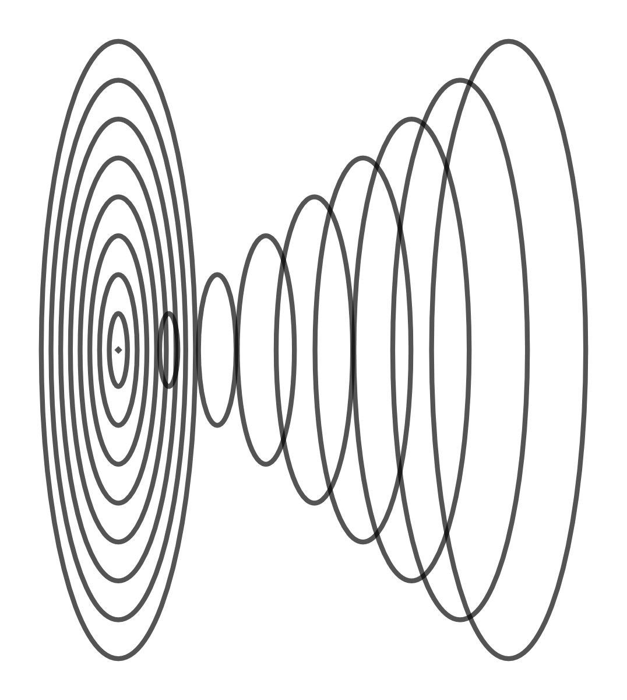
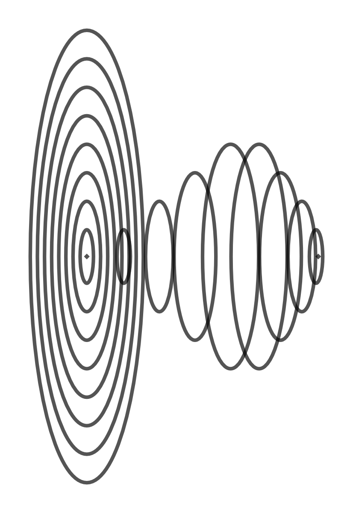
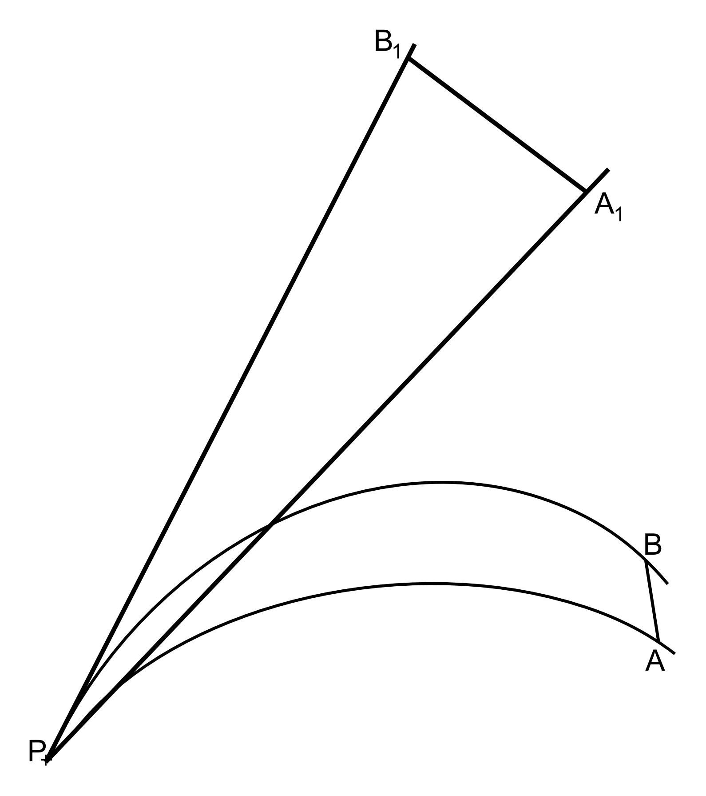
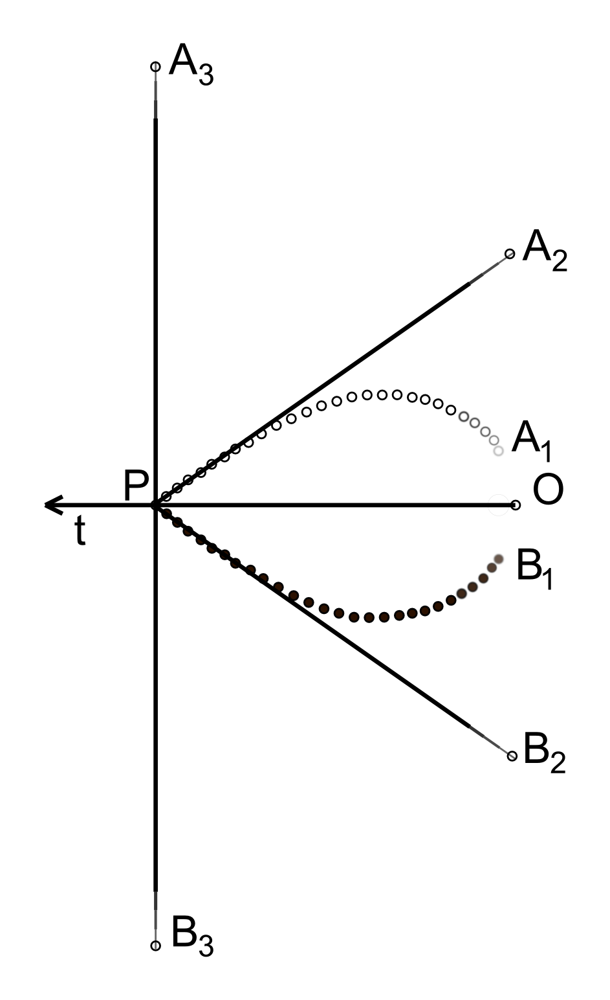
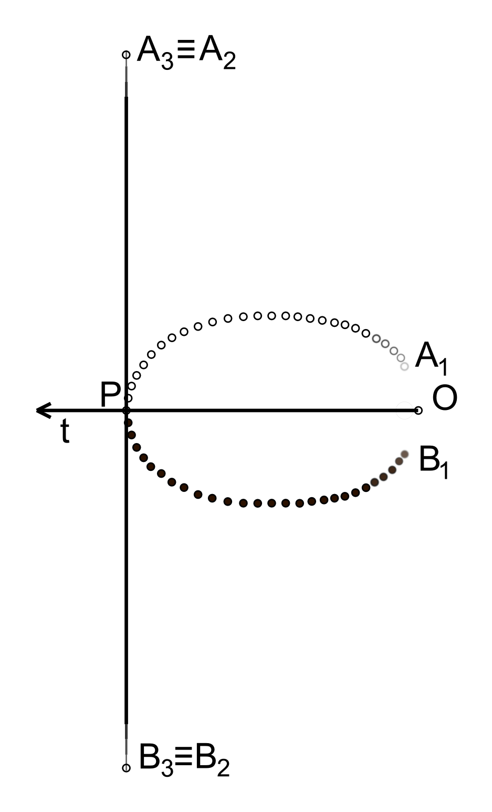

## VIII. Úvahy o geometrii vesmíru

Představa o vesmíru se měnila, mění a bude měnit nejen podle toho, co všechno už víme o jevech kolem nás,
ale i v závislosti na tom, jaké umíme tvořit modely. 
...
<!--Je dobré si v tomto místě uvědomit, že existuje velmi úzký vztah mezi fyzikou a geometrií.
Některé jevy, například gravitaci, můžeme vysvětlovat buď působením síly (čili fyzikální veličiny)
nebo pomocí zakřivení časoprostoru (čili geometricky). Při různých předpokladech týkajících se geometrie
časoprostoru můžeme dostat různé fyzikální vlastnosti.

Pokusme se na chvíli zapomenout všechno, co o vesmíru víme, a zamysleme se nad tím, jaký model vesmíru
by si mohl utvořit inteligentní počítač na základě toho, co se dá přímo pozorovat.

Všechny objekty, které vidíme na nebi, si promítáme na nebeskou sféru, kterou si představujeme
jako povrch hodně velké koule, v jejímž středu se nacházíme. Vzdálenost objektů přímo změřit nemůžeme,
ale na základě různé velikosti a jasnosti objektů můžeme usuzovat, že jsou od nás různě vzdálené.
Zaveďme si proto pojem **„sféry pozorovatele“** pro všechny sféry se středem v místě pozorovatele,
od nejmenších až po sféru s poloměrem po nejvzdálenější viditelné objekty. Pro daného pozorovatele
si pak můžeme celý pozorovatelný vesmír představit jako souhrn všech sfér pozorovatele.

Z analýzy spektrálních čar ve spektru vzdálených objektů vyplývá, že dochází k posunu směrem
k dlouhovlnému konci spektra. Tento posun je tím větší, čím je větší vzdálenost pozorovaného objektu.
Jednou z možností, jak tento jev vysvětlit, je přijmout předpoklad o rozpínání vesmíru.
V takovém případě můžeme též předpokládat, že vesmír zpočátku musel být hodně malý,
prakticky bodový, a my tento bod budeme považovat za začátek času.

Vzhledem k tomu, že se světlo šíří konečnou rychlostí (zhruba 300000km/s), je důležité si uvědomit,
že čím má sféra pozorovatele větší poloměr, tím je od pozorovatele dále v čase.
Vzdálené objekty nevidíme tak, jak vypadají nyní, ale tak, jak vypadaly kdysi. Slunce vidíme tak,
jak vypadalo před zhruba osmi minutami, další nejbližší hvězdy tak, jak vypadaly před mnoha lety
a nejvzdálenější objekty vidíme tak, jak vypadaly před miliardami let. Sféry pozorovatele
si tedy můžeme představit poskládané vedle sebe v čtyřrozměrném časoprostoru. Protože je dost obtížné
představit si útvary v čtyřrozměrném časoprostoru, pokusíme se nejprve představit si,
jak vypadá řez sférami pozorovatele.

Řez sférami pozorovatele si můžeme představit jako systém soustředných kružnic se společným středem
v místě pozorovatele. Pozorovateli se zdá, že všechny kružnice leží v rovině a mají čím dál větší
poloměr. Každá kružnice se ale nachází v jiném čase. Pokud si čas znázorníme jako další rozměr
kolmý do roviny řezu, pak si pozorovatel může představit, že kružnice tvoří v časoprostoru kužel
(viz obr. VIII.1).

Obr. VIII.1 Kružnice tvořící řez sférami pozorovatele si můžeme představit jako kužel v časoprostoru.

I když se pozorovateli zdá, že čím je kružnice vzdálenější, tím má větší obvod,
musí být obvod nejvzdálenějších kružnic malý, protože předpokládáme, že se vesmír rozpíná
a v nejvzdálenější minulosti byl hodně malý. Takže kružnice netvoří v časoprostoru kužel,
ale povrch rotačního tělesa s jedním vrcholem v místě pozorovatele a druhým vrcholem v počátku času
(viz obrázek VIII.2).

Obr. VIII.2 Kružnice řezu sférami pozorovatele, které se pozorovateli jeví jako největší, musí být malé.

Odtud vyplývá, že světlo k nám přichází po zakřivené dráze a vzdálené oblasti vesmíru vidíme hodně zdeformované.
Zároveň to vysvětluje, proč v nejvzdálenějších oblastech vidíme ve všech směrech prakticky totéž.
Nezávisle na tom, kterým směrem se díváme, díváme se do toho samého bodu, do začátku času.

Pokud k nám světlo od vzdálených objektů přichází po zakřivených drahách, nemůžeme úhel ve stupních,
pod kterým objekt vidíme, zaměnit na radiány. Skutečné rozměry a vzdálenosti objektů mohou být úplně jiné,
než jak je vidí pozorovatel (viz obrázek VIII.3)

Obr. VIII.3 Pokud je dráha světla zakřivená, může pozorovatel P vidět úsečku AB,
která je ve skutečnosti velmi malá, jako hodně velkou úsečku A1B1.

Pozorovatel zakřivení dráhy světelného paprsku nevnímá a všechny objekty vidí v tom směru,
ze kterého k němu světelný paprsek přichází.

Jak vypadá skutečná dráha světla, to přímo zjistit nemůžeme. Pokusíme se ale udělat si alespoň přibližnou představu,
jak by mohla vypadat. Provedeme ještě jeden řez sférami pozorovatele a dostaneme pouze body,
které pozorovatel  může vidět přímo nad sebou (nebo přímo pod sebou, pokud by mu v tom nic nepřekáželo).

Obr. VIII.4 Jak i kde vidíme vzdálené objekty a jaká je dráha světelného paprsku od objektu k pozorovateli.

Na obrázku VIII.4 v bodě O předpokládáme začátek času, čas plyne ve směru šipky t, pozorovatel je v bodě P.
Jestliže pozorovatel P se dívá přímo vzhůru (a nepřekáží mu žádný bližší objekt),
vidí v největší vzdálenosti bod A3 (pokud by měl možnost dívat se dolů, viděl by v největší vzdálenosti bod B3).
Vzhledem k tomu, že v největší vzdálenosti vidí objekty z doby, kdy byl vesmír ještě malý,
musí se tyto objekty nacházet v časoprostoru blízko sebe, někde v okolí bodu O. Na obrázku jsou znázorněné
jako A1 a B1. Dráha světla tedy nemůže být přímá. Její přesný tvar ale z toho, co jsme si dosud uvedli,
ještě nevyplývá. Na obrázku VIII.4 je znázorněna jedna z možností dráhy světla (bílé body nahoře, černé dole).

Na základě obrázku VIII.4 bychom mohli usuzovat, že světlo přichází od vzdálených objektů k pozorovateli pod úhlem,
a že by měl vidět objekty A1 a B1 jako body A2 a B2. Ale pozorovatel se nemůže dívat ve směru času,
pouze ve směru prostoru. I když ze současného prostoru vidí pouze nepatrný kousek
(můžeme předpokládat, že do vzdálenosti Plancka), stačí to k tomu, aby světlo k němu přicházelo ze směru prostoru,
to znamná na obrázku VIII.4 shora i zdola.

Je ale možné, že tvar dráhy světla je v blízkosti pozorovatele více zaoblený a tečna PA2 je totožná s PA3
(viz obrázek VIII.5):

Obr. VIII.5 Jiná možná dráha světelného paprsku od vzdálených objektů k pozorovateli.

Jestliže dráha světelných paprsků, které k nám přicházejí od dalekých objektů, není přímá,
nemůžeme z pozorované rychlosti rotace objektů vypočítat chybějící temnou hmotu. Naopak, pokud připustíme,
že temná hmota neexistuje nebo jí je zanedbatelně málo, můžeme se pokusit z neshodnosti mezi pozorovanou rychlostí
rotace a pozorovanou hmotou vypočítat zakřivení dráhy světelných paprsků.

Pro lepší názornost jsme se zatím zabývali pouze řezy  sférami pozorovatele. Ale zobecněním toho,
co jsme si ukázali, dostaneme, že sféry pozorovatele tvoří povrch rotačního tělesa v čtyřrozměrném časoprostoru
s jedním vrcholem v místě pozorovatele a druhým v počátku času.

Nyní se pokusme odpovědět na otázku, jaká by mohla být geometrie celého vesmíru.

Kdysi dávno si lidé mysleli, že je Země plochá a trvalo hodně dlouho, než došli k závěru, že musí být kulatá.
Obdobně si nyní většina lidí představuje vesmír jako „plochý“, čili že souřadnice časoprostoru jsou zhruba přímé
a na sebe kolmé. Pokud ale předpokládáme, že vesmír vznikl velkým výbuchem prakticky z jednoho bodu
(který jsme přijali za začátek času) a od té doby se s rostoucím časem rozpíná, pak
(pokud budeme za současný prostor považovat takové body časoprostoru, které mají stejnou vzdálenost
v čase od začátku času) prostor v našem modelu musí mít tvar povrchu koule. Časoprostor si můžeme představovat
jako čtyřrozměrnou kouli, jejíž střed představuje začátek času, čas představuje vzdálenost od počátku
a prostor v každé konkrétní chvíli představuje trojrozměrný povrch čtyřrozměrné koule o odpovídajícím poloměru.

Předpokládáme tu, že vesmír má tři prostorové dimenze a jednu dimenzi časovou
(i když později připustíme i jiné možnosti).

Vesmír v tomto modelu má počátek v čase, který je ve středu koule, ale nemá počátek v prostoru,
protože prostor v každé chvíli představuje povrch koule o poloměru určeném časem.

Trochu více o modelování časoprostoru si uvedeme ještě v příloze C.

Prozatím jsme v našich úvahách vůbec nebrali ohled na to, kolik hmoty je ve vesmíru.
Bez ohledu na to, kolik jí je,  jsme předpokládali, že tvar časoprostoru je vždy koule,
která se rovnoměrně rozšiřuje.

Můžeme přijmout další předpoklad, že hmota zpomaluje běh času. Potom pokud by bylo hmoty víc,
rozpínání vesmíru by bylo pomalejší. Koule by byla menší a měla by tedy větší křivost.
Při nerovnoměrném rozmístění hmoty v prostoru by též každá hmota způsobila dodatečné zakřivení prostoru.
V hmotnějších oblastech by čas plynul pomaleji, rozpínání prostoru by zde bylo pomalejší,
a prostor by se ohýbal ve směru počátku času.

Vzhledem k tomu, že při rozpínání prostoru se průměrná hustota hmoty zmenšuje,
měl by se prostor podle našeho modelu rozpínat stále rychleji.

Neznamená to ale, že se musí rozpínat do nekonečna. Pokud připustíme možnost zakřivení času,
jsou možné další různé varianty. K některým se ještě vrátíme.

Další problém, u kterého bychom se mohli zastavit, je počet dimenzí vesmíru. Zdá se nám, že existují
tři prostorové dimenze, a více jich být nemůže. Z různých teoretických úvah ale vyplývá,
že by dimenzí mohlo být víc. Protože je nevidíme a neumíme si je představit, byla vyslovena hypotéza,
že vyšší dimenze mohou být stočené do tak malých rozměrů, že je prostě nevidíme. Možná je ale všechno úplně jinak.
Čas je přece v teorii relativity chápán jako čtvrtý rozměr a též ho nevidíme. Prostě tři rozměry vnímáme zrakem,
a zbývající vnímáme nějak jinak, nebo nevnímáme vůbec. Například pokud připustíme, že hmota způsobuje zakřivení
prostoru, pak si toto zakřivení můžeme  představit jako deformaci do vyšší dimenze. Čili máme další dimenzi,
kterou nevidíme, ale vnímáme jako gravitační pole.

Kromě toho, v modelu vesmíru, který jsme popsali výše, jsme předpokládali, že prostorové souřadnice jsou zatočené
do kruhu, ale čas jsme považovali za lineární. A čas se může také zatáčet do kruhu. V geometrickém znázornění
pak potřebujeme i pro čas další dimenzi (i když v analytickém zápisu se zdá pravděpodobné, že čas bude lépe
chápat jako komplexní číslo). Pokud se ukazuje, že pro čas můžeme potřebovat další dimenzi
(pro geometrické znázornění imaginární hodnoty času), pak je možné, že i u prostorových souřadnic vnímáme
pouze reálnou část a pro imaginární hodnotu budeme v geometrickém znázornění potřebovat dodatečné dimenze.

Na druhou stranu náš časoprostor nemusí vůbec mít více rozměrů, než se nám zdá, ale může jich mít naopak méně.
Z teoretického modelu černých děr vyplývá, že náš vesmír může být pouze dvourozměrný a trojrozměrná představa
prostoru vzniká pouze v našem mozku jako jakási obdoba hologramu.

Ještě více problémů než s prostorem máme ale s časem. V teorii relativity se čas chápe jako čtvrtý rozměr,
ale dost uměle mu dáváme jiné vlastnosti než rozměrům prostorovým. Ze samotné teorie relativity nevyplývá,
že pohyb v čase je možný pouze jedním směrem. Dodáváme si takové omezení na základě našich zkušeností,
ze kterých vyplývá, že se nedá couvat v čase. Můžeme se ale mýlit a nemusí to platit obecně.
Kdyby vesmírem letěl nějaký inteligentní mrak, který by nemohl měnit směr pohybu, mohl by dojít na základě
vlastních zkušeností k závěru, že prostorem se dá pohybovat pouze jedním směrem. Teprve při zkoumání pohybu
mikročástic by zjistil, že se mohou pohybovat i jinak. Připusťme tedy pro začátek alespoň pro mikročástice
možnost pohybu nejen v prostoru, ale i v čase. Jaké jevy v takovém případě budeme očekávat?
Jednak nebude možné jednoznačně určit polohu částice, protože při kmitání současně v prostoru i v čase
bude částice neustále mizet a objevovat se v různých místech s různou pravděpodobností. Částice též může projít
zároveň dvěma štěrbinami umístěnými blízko sebe, protože po projití jednou štěrbinou se může couvnout v čase
a projít druhou (co se může mnohokrát opakovat). Může též nastat interference částice samé se sebou,
protože se částice může nacházet v jedné chvíli v různých místech. Mnoho „záhadných“ kvantových jevů se tak stane
srozumitelných a logických.V našem modelu jsme schopni nastínit vysvětlení i tak nepochopitelného jevu,
jakým je ztráta vlnových vlastností částic, pokud je pozorujeme. Stačí připustit, že každé měření tlumí
vibrace částic v čase.

Pokud připustíme existenci jedné základní částice, kterou může být například superstruna, a dáme jí možnost
couvat v čase, pak vesmír mohl vzniknout z jedné takové částice. Za jistých předpokladů může z jedné částice
vzniknout ohromné množství částic, nebo přesněji řečeno, může se tato částice objevit najednou mnohokrát
vedle sebe a různými interakcemi samé se sebou dát vzniknout všem známým částicím. Zároveň nám to dává
logické vysvětlení, proč jsou elementární částice nerozlišitelné.

Pokud připustíme pro elementární částice možnost couvání v čase, pak můžeme připustit i možnost,
že se může nějaká informace z budoucnosti dostat do přítomnosti. I kdyby se to dělo pouze na úrovní
elementárních částic, mohlo by to mít vliv na vznik komplexity a v speciálním případě na vznik života.
Složitější stabilní struktury, které se objeví teprve v budoucnosti, by již působily na přítomnost
a ovlivňovaly ji tak, aby mohly vzniknout. Pokud bychom připustili takový mechanizmus,
evoluce by probíhala mnohem rychleji, než v případě pouze náhodných křížení a mutací.
A možných důsledků by bylo ještě mnohem víc.

Další předpoklad, který můžeme přijmout, je existence nejmenší vzdálenosti, kterou již nemůžeme dělit.
Tento předpoklad nám dává možnost vzdát se v našem modelu nekonečna, ale na druhou stranu
ztrácíme spojitost prostoru a času, které se stávají „zrnité“, a musíme nějak vyřešit strukturu
rozložení těchto „zrn“.

Z předpokladu nejmenší délky a nejkratšího časového intervaly dostaneme nejmenší rychlost danou jejich podílem.
Tato rychlost je nejen základní veličinou našeho modelu, ale pokud přijmeme předpoklad,
že největší možná rychlost je rychlost světla, pak je jedinou rychlostí, která se v něm vyskytuje.
Problémem pak je, odkud se může vzít rychlost menší než rychlost světla. Při nejmenším časovém kroku
musí dojít k přemístění alespoň o nejmenší délku. Částice se ale nemusí přemísťovat přímočaře.
Pokud jsou částice hmotné, zakřivují kolem sebe časoprostor. A u makroskopických objektů složených
z velkého množství kmitajících částic může přemístění i o malou délku trvat hodně dlouho.

Shodně s kvantovou teorií elementární částice nemohou být v klidu (pokud známe jejich polohu,
nemohou mít nulovou hybnost), a jelikož každá hmota způsobuje zakřivení časoprostoru
(shodně s teorií relativity i našimi předpoklady), časoprostor se v okolí každé kmitající částice
neustále deformuje. Takže prostor je nejen zakřivený a „zrnitý“, ale i „dynamický“.
Klasické matematické modely předpokládají spojitý stálý prostor a čas plynoucí jedním směrem.
Pro modelování „zrnitého“ dynamického prostoru při vibracích v čase pravděpodobně bude výhodnější
využít buněčné automaty, musíme ale nalézt vhodnou strukturu a vhodná pravidla.

Každý si může vymyslet vlastní model, nebo třeba stovky modelů.  Ale je třeba si uvědomit,
že i když budou geniální a budou vysvětlovat všechny známé jevy, stále to budou pouze modely
a skutečnost je mnohem složitější.

Je dobré si též uvědomit, že náš model světa určuje, co považujeme za možné a co za nemožné.
A touto problematikou se budeme zabývat v následující kapitole.

## [IX. Co považujeme za možné a co za nemožné](rozdzial9) -->
